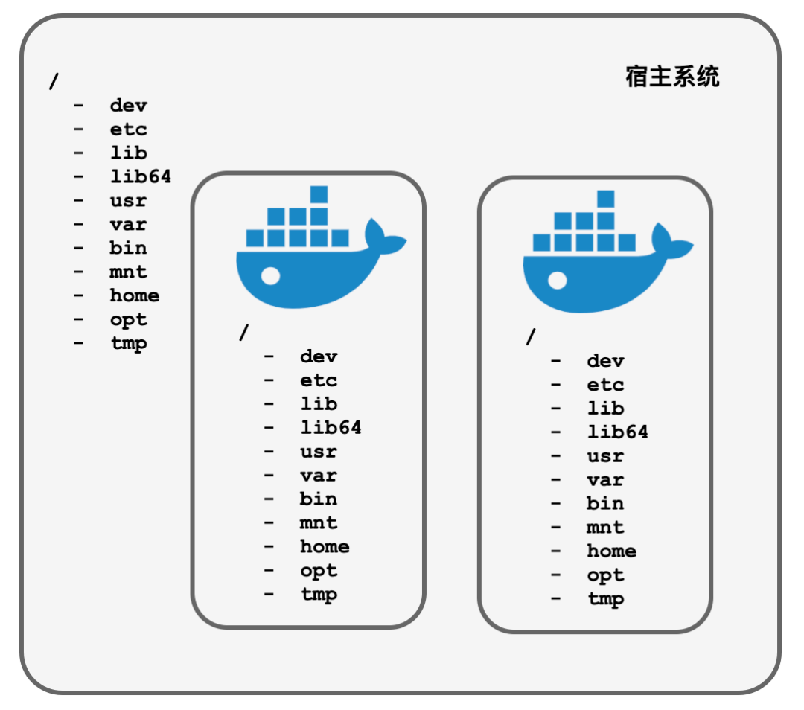

# 使用busybox创建容器

## busybox
BusyBox是一个遵循GPL协议、以自由软件形式发行的应用程序。Busybox在单一的可执行文件中提供了精简的Unix工具集，可运行于多款POSIX环境的操作系统，例如Linux（包括Android）、Hurd、FreeBSD等等。由于BusyBox可执行文件的文件比较小，使得它非常适合使用于嵌入式系统。作者将BusyBox称为“嵌入式Linux的瑞士军刀”。

可以通过以下方式来获取到busybox的文件系统：
```shell
# 首先启动一个busybox容器
$ docker pull busybox
$ docker run -d busybox top -b
bcd7579ee688

# docker export 将容器打包成tar包
$ docker export -o busybox.tar bcd7579ee688
$ tar -xvf busybox.tar -C busybox/
$ [busybox] ls -l
total 0
drwxr-xr-x  404 bytedance  staff  12928 12  7 08:20 bin
drwxr-xr-x    5 bytedance  staff    160 12 11 15:36 dev
drwxr-xr-x   11 bytedance  staff    352 12 11 15:36 etc
drwxr-xr-x    2 bytedance  staff     64 12  7 08:20 home
drwxr-xr-x    2 bytedance  staff     64 12 11 15:36 proc
drwx------    2 bytedance  staff     64 12  7 08:20 root
drwxr-xr-x    2 bytedance  staff     64 12 11 15:36 sys
drwxr-xr-x    2 bytedance  staff     64 12  7 08:20 tmp
drwxr-xr-x    3 bytedance  staff     96 12  7 08:20 usr
drwxr-xr-x    4 bytedance  staff    128 12  7 08:20 var
```

## pivot_root
```c
int syscall(SYS_pivot_root, const char *new_root, const char *put_old);
```
这是一个系统调用，用来修改一个系统的根目录到一个新的位置。


我们通过一个这个函数来将容器进程的系统根目录修改成busybox的根目录。
之后，我们可以在新的根系统中进行一系列mount操作。


## 效果
```shell
$ [zocker] go build .
$ [zocker] sudo ./zocker run -ti sh
/ ls -l
drwxr-xr-x  404 bytedance  staff  12928 12  7 08:20 bin
drwxr-xr-x    5 bytedance  staff    160 12 11 15:36 dev
drwxr-xr-x   11 bytedance  staff    352 12 11 15:36 etc
drwxr-xr-x    2 bytedance  staff     64 12  7 08:20 home
drwxr-xr-x    2 bytedance  staff     64 12 11 15:36 proc
drwx------    2 bytedance  staff     64 12  7 08:20 root
drwxr-xr-x    2 bytedance  staff     64 12 11 15:36 sys
drwxr-xr-x    2 bytedance  staff     64 12  7 08:20 tmp
drwxr-xr-x    3 bytedance  staff     96 12  7 08:20 usr
drwxr-xr-x    4 bytedance  staff    128 12  7 08:20 var
/ mount
/dev/sda5 on / type ext4 ...
proc on /proc type proc ...
tmpfs on /dev type tmpfs ...
```