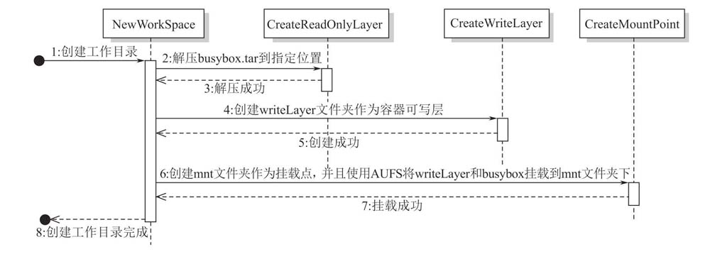

# 使用AUFS包装busybox
## AUFS 是什么
AUFS（全称：advanced multi-layered unification filesystem，高级多层统一文件系统），用于为 Linux 文件系统实现联合挂载。
- 它使用 branch 把不同文件系统的文件和目录"透明地"覆盖，形成一个单一一致的文件系统。
- copy-on-write，简写为 CoW，也叫隐式共享，是一种提高资源使用效率的资源管理技术。它的思想是：如果一个资源是重复的，在没有对资源做出修改前，并不需要立即复制出一个新的资源实例，这个资源被不同的所有者共享使用。当任何一个所有者要对该资源做出修改时，复制出一个新的资源实例给该所有者进行修改，修改后的资源成为其所有者的私有资源。
  
通过 AUFS, 我们可以实现在容器内部对文件系统的新增，不会影响到镜像的文件系统

## 引入思路
我们在启动容器前，挂载一个文件系统，它具有一个只读层和一个可读可写层。只读层用来读取 busybox 的文件系统，
可读可写层用来存储在容器中新建的文件、修改的文件等。
- 只读层：`/root/busybox`
- 可读可写层：`/root/writeLayer`

我们可以通过下面的命令来创建 aufs：
```shell
mount -t aufs -o dirs=/root/writeLayer:/root/busybox none /root/mnt
```
在 mount 命令中我们没有指定要挂载的 2 个文件夹的权限信息，其默认行为是：dirs 指定的左边起第一个目录是 read-write 权限，后续目录都是 read-only 权限


## 代码中时序图
