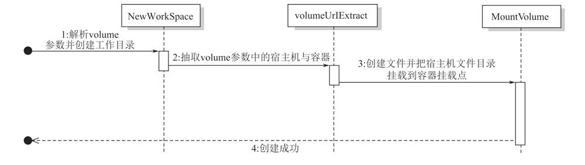

# 实现 volume 数据卷
当我们通过容器启动 Mysql 时，一定不希望数据因为断掉、宿主机 crash 等突发问题而造成丢失。
Docker 可以通过`-v`参数将容器所在的宿主机的目录或文件**挂载**到容器内容的某个位置，在容器内部对其进行的写操作将会被持久化。
这样，当容器被销毁后重新启动容器进行挂载，之前的数据还是存在的。

这次，我们就要为 zocker 添加绑定数据卷的功能。

## 实现思路
1. 首先在命令行交互中增加`-v`参数的解析和传递
2. 在启动子进程（容器）时，先使用 AUFS 来创建容器的文件系统
3. 在宿主机创建宿主目录（来自-v参数中冒号前面的值），在容器中创建对应目录（来自-v参数中冒号后面的值）
4. 将宿主目录和容器目录通过 aufs 方式挂载（默认挂载的第一个目录是可写可读的），这相当于在容器中又多了一个可写层
5. 当容器退出时，我们值对宿主目录和容器目录进行解绑`umount`操作，而不删除宿主目录，这样就保留了容器中的写数据

## 代码中的时序图

