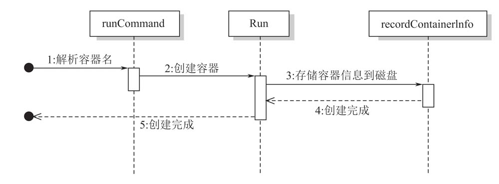
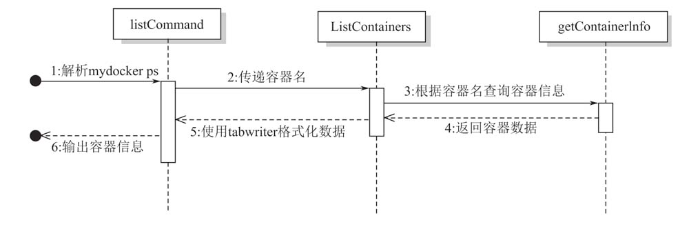

# 实现查看运行中的容器
上一节实现了容器的后台运行，如果我们想查询后台运行的容器有哪些，如何实现 docker 的 ps 的功能呢？
```shell
> docker ps
CONTAINER ID   IMAGE              COMMAND                  CREATED        STATUS                             PORTS                                                                  NAMES
d6a8796fcb01   gitlab/gitlab-ce   "/assets/wrapper"        5 weeks ago    Up 12 seconds (health: starting)   0.0.0.0:30001->22/tcp, 0.0.0.0:30000->80/tcp, 0.0.0.0:30002->443/tcp   gitlab
6754f62e8b4d   mysql:5.7          "docker-entrypoint.s…"   2 months ago   Up 12 seconds                      0.0.0.0:3306->3306/tcp, 33060/tcp                                      mysql577
03aa6da64724   redis:4            "docker-entrypoint.s…"   5 months ago   Up 12 seconds                      0.0.0.0:6379->6379/tcp                                                 redis
```

## 实现思路
1. 在启动容器时将相关信息（比如：PID、创建时间、容器运行命令、容器名、状态）记录下来
2. 当调用`zocker ps`时去查询记录接口

### 1.记录容器信息
在调用`zocker run -d --name bird top`时，在启动子进程前，现将容器信息保存起来

需要注意一点：如果容器的运行方式不是后台运行，当容器退出时，需要将容器信息删除。

### 2.实现 zocker ps 命令
新增`ps`子命令，实现查询记录的容器信息，并打印到命令行终端

是想答应到命令行终端时，使用了`text/tabwriter`库，它可以是想将文本按照对齐的方式输出到终端

## 运行效果
我们以 top 命令为例代表后台持续运行的一个子进程
```shell
vagrant@vagrant-ubuntu-trusty-64:/vagrant_data/zocker$ sudo ./zocker run -d --name bird top
INFO[0000]/vagrant_data/zocker/run.go:53 main.sendInitCommand() command all is top
# 使用docker ps 查看
vagrant@vagrant-ubuntu-trusty-64:/vagrant_data/zocker$ sudo ./zocker ps
ID           NAME        PID         STATUS      COMMAND     CREATED
5501594387   bird        1897        running     top         2022-04-03 10:20:58
```
我们再尝试启动另一个终端运行一个非后台执行的容器，查看退出前后的变化
```shell
# 终端2
vagrant@vagrant-ubuntu-trusty-64:/vagrant_data/zocker$ sudo ./zocker run -ti sh
INFO[0000]/vagrant_data/zocker/run.go:53 main.sendInitCommand() command all is sh
INFO[0000]/vagrant_data/zocker/main_command.go:17 main.glob..func1() init come on
INFO[0000]/vagrant_data/zocker/container/init.go:60 github.com/Zioyi/zocker/container.setUpMount() Current locaion is /root/mnt
INFO[0000]/vagrant_data/zocker/container/init.go:32 github.com/Zioyi/zocker/container.RunContainerInitProcess() Find path /bin/sh
/ # ps
PID   USER     TIME  COMMAND
    1 root      0:00 sh
    5 root      0:00 ps
```
```shell
# 终端1
vagrant@vagrant-ubuntu-trusty-64:/vagrant_data/zocker$ sudo ./zocker ps
ID           NAME         PID         STATUS      COMMAND     CREATED
5572817396   5572817396   2011        running     sh          2022-04-03 10:23:48
5501594387   bird         1897        running     top         2022-04-03 10:20:58
```
此时可以看到有两个容器，我们在将`5572817396`退出
```shell
# 终端2
/ # exit
vagrant@vagrant-ubuntu-trusty-64:/vagrant_data/zocker$
```
```shell
# 终端1
vagrant@vagrant-ubuntu-trusty-64:/vagrant_data/zocker$ sudo ./zocker ps
ID           NAME        PID         STATUS      COMMAND     CREATED
5501594387   bird        1897        running     top         2022-04-03 10:20:58
```