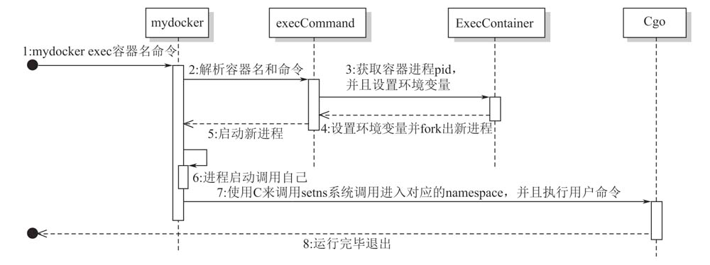

# 实现进入容器的Namespace
我们已经实现了将容器以后台的方式运行，那我们如何才能重新进入这个在后台运行着的容器呢？

这就是我们本次要实现的能力：重新进入在后台运行着的容器。我们通过`docker exec $containerName $cmd`的命令来实现

## 实现思路
参考 Docker 的 exec 命令，它是在一个存在的容器中运行一个进程，通过系统调用`setns`将新的进程加入的原来容器的 namespace 中，使得新的进程可以看到原容器的面貌。

这里有一个难点是：`setns`不能正确的在 Go runtime 这样的多线程环境下工作，我们需要在新进程启动 runtime 多线程环境之前完成 setns 的相关操作。
Go 语言并没有直接在一个程序启动前执行某段代码的机制，但 C 语言却可以通过 gcc 的扩展`__attribte__((constructor))`来实现在程序启动前执行特定代码，
因此 Go 就通过 cgo 嵌入这样一段 C 代码来完成 runtime 启动前执行特定的 C 代码。



## 运行效果
先以后台方式运行容器`seven`
```shell
vagrant@vagrant-ubuntu-trusty-64:/vagrant_data/zocker$ sudo ./zocker run --name seven -d top
missing zocker_pid env skip nsenter
INFO[0000]/vagrant_data/zocker/run.go:59 main.sendInitCommand() command all is top
INFO[0000]/vagrant_data/zocker/run.go:46 main.Run() [zocker] container name is seven
```
然后通过 exec 命令进入容器
```shell
vagrant@vagrant-ubuntu-trusty-64:/vagrant_data/zocker$ sudo ./zocker exec seven sh
missing zocker_pid env skip nsenter
INFO[0000]/vagrant_data/zocker/exec.go:27 main.ExecContainer() container pid 1961, comand sh
got zocker_pid=1961
got zocker_cmd=sh
setns on ipc namespace succeeded
setns on uts namespace succeeded
setns on net namespace succeeded
setns on pid namespace succeeded
setns on mnt namespace succeeded
/ #
# 可以看到 PID 为 1 的进程是 TOP，就是刚才运行的容器
/ # ps -ef
PID   USER     TIME  COMMAND
    1 root      0:00 top
    6 root      0:00 sh
    8 root      0:00 ps -ef
```