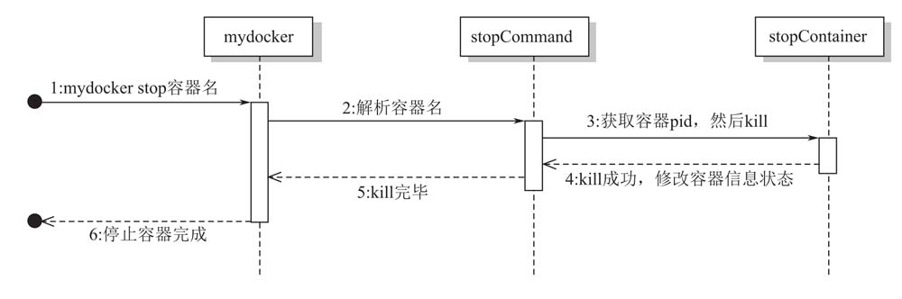

# 实现停止容器
本次实现停止运行中的容器。

## 实现思路
1. 在命令行中增加`stop`子命令，使用时需要传入想要停止的容器名
2. 通过容器名找到对应运行的进程ID`pid`
3. 系统调用`kill -15`杀掉进程
4. 更新容器的状态信息，从`running`变成`stopping`




## 运行效果
```shell
# 先以后台方式运行一个容器
vagrant@vagrant-ubuntu-trusty-64:/vagrant/data/zocker$ sudo ./zocker run -d --name bird top
INFO[0000]/vagrant/data/zocker/run.go:59 main.sendInitCommand() command all is top                           
INFO[0000]/vagrant/data/zocker/run.go:46 main.Run() [zocker] container name is bird 

# 此时容器的状态是running
vagrant@vagrant-ubuntu-trusty-64:/vagrant/data/zocker$ sudo ./zocker ps
ID           NAME        PID         STATUS      COMMAND     CREATED
7318006693   bird        1904        running     top         2022-04-30 19:54:59

# 使用stop命令
vagrant@vagrant-ubuntu-trusty-64:/vagrant/data/zocker$ sudo ./zocker stop bird

# 此时容器的状态是stopped
vagrant@vagrant-ubuntu-trusty-64:/vagrant/data/zocker$ sudo ./zocker ps
ID           NAME        PID         STATUS      COMMAND     CREATED
7318006693   bird                    stopped     top         2022-04-30 19:54:59
```